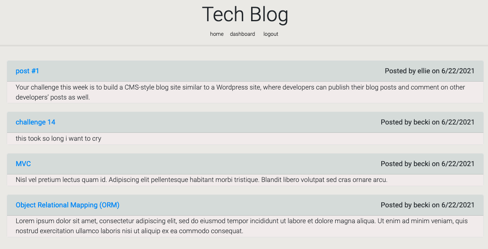
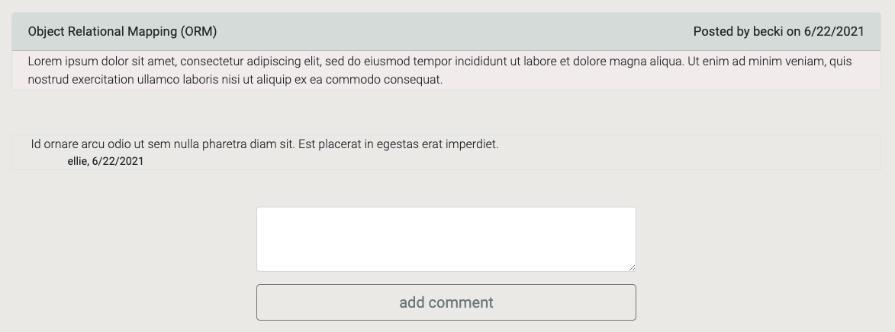
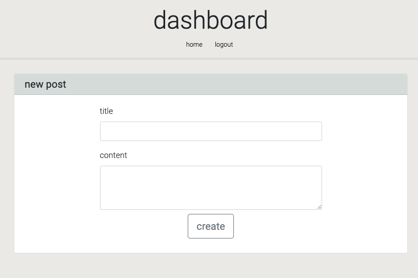

# Tech Blog

## Table of Contents

- [Description](#description)
- [Instructions](#instructions)


## Description
A CMS-style blog site similar to a Wordpress site, where developers can publish their blog posts and comment on other developers’ posts as well.






Link to deployed application: 

## Instructions
Clone the repo and run ```npm i``` in the terminal.

Create an '.env' file in the root folder and add the following: 
```
DB_NAME='tech_blog_db'
DB_USER=[YOUR MYSQL USERNAME]
DB_PW=[YOUR MYSQL PASSWORD]
``` 